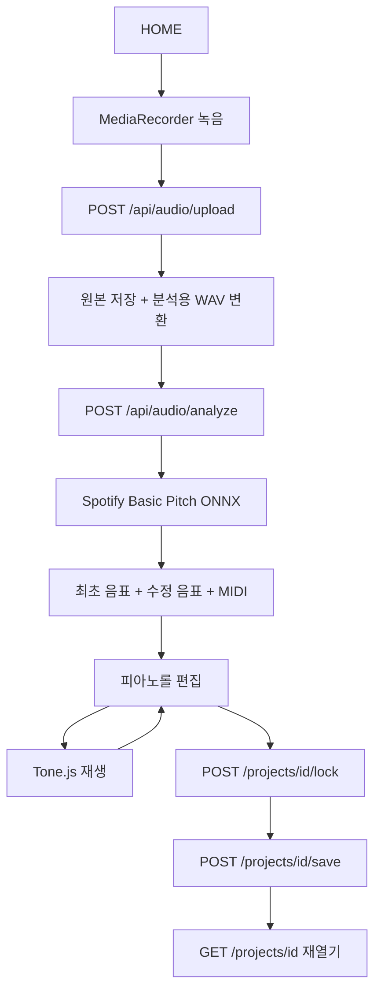

# Phase 1 설계

## 실행 흐름



## API

모든 경로는 `/api`로 시작합니다. Frontend는 Next.js rewrite를 통해 같은 origin으로 요청합니다. 최대 분석 대기 시간은 5분으로 설정했습니다. 요청이 끊겨도 이미 업로드한 프로젝트는 목록에서 다시 열 수 있습니다.

| 메서드/경로 | 입력 | 결과 |
| --- | --- | --- |
| GET /health | 없음 | 서비스 상태, 분석 엔진, STT 상태 |
| POST /audio/upload | multipart: file, input_type=hum 또는 song | 201: project_id, audio 메타데이터, project |
| POST /audio/analyze | JSON: project_id | project_id, tempo, notes, project |
| GET /projects | 없음 | 최근 수정순 목록 |
| GET /projects/{id} | 없음 | 전체 프로젝트 |
| PUT /projects/{id} | ProjectEdit | 임시 저장된 프로젝트 |
| POST /projects/{id}/lock | ProjectEdit | 멜로디 확정된 프로젝트 |
| POST /projects/{id}/save | ProjectEdit | status=saved 프로젝트 |
| GET /projects/{id}/audio | 없음 | 원본 오디오, range 요청 지원 |
| GET /projects/{id}/midi | 없음 | 저장 상태로 재생성한 MIDI |

ProjectEdit:

```json
{
  "revision": 2,
  "title": "나의 첫 노래",
  "notes": [{"id": "note_1", "pitch": 60, "start": 0.5, "end": 1.2, "velocity": 0.8}],
  "lyrics_edited": "나의 가사"
}
```

음 이름은 서버가 MIDI pitch에서 계산합니다. 원본 오디오/음표, original 가사, locked 상태를 임의 변경하는 API는 없습니다. 모든 수정·확정 요청에 현재 revision이 필요합니다. revision 불일치는 409입니다. 이미 분석한 프로젝트의 analyze 재호출은 저장 상태를 그대로 반환합니다.

## 보존 규칙

- original_audio는 업로드한 바이트 그대로 저장하며, 정규화는 analysis.wav에만 적용합니다.
- original_notes는 최초 **성공한** 분석 후에 생성합니다. 분석 실패는 가짜 음표로 대체하지 않습니다.
- 원본은 임시 파일 작성 후 hard link로 원자적으로 생성합니다. 대상이 존재하면 실패하므로 덮어쓰지 않습니다.
- 편집 값은 edited_notes로만 저장합니다. MIDI도 edited_notes에서 생성합니다.
- MIDI 생성이 실패하면 lock/save 상태를 갱신하지 않습니다.
- JSON 스냅샷 각각의 저장은 원자적입니다. 여러 파일 전체가 하나의 DB 트랜잭션은 아닙니다. project.json을 기준으로 보고 MIDI 다운로드 시 기준 데이터로 재생성합니다. 전원 장애 직후 파생 파일이 뒤처질 경우 다음 저장으로 다시 생성할 수 있습니다.
- Melody Lock은 서버와 화면 양쪽에서 음표 수정을 차단합니다. 확정 후에도 프로젝트 이름과 edited 가사는 저장할 수 있습니다. 확정 해제는 Phase 1에 없습니다.

## 교체 가능한 구성

- `models/project.py`: Pydantic 모델. API 입력 검증 및 저장 형식.
- `services/repository.py`: 프로젝트 JSON 읽기/쓰기. PostgreSQL/Supabase 이전 시 ProjectRepository 구현과 main.py의 의존성 연결을 교체합니다. revision 검사와 잠금은 DB 트랜잭션으로 이전합니다.
- `services/storage.py`: 파일 read/write/path 추상화. R2/S3 구현에서는 `path()`에 필요한 임시 로컬 캐시를 제공하거나 분석 입출력을 스트림/다운로드 단계로 교체합니다. immutable 쓰기는 object storage의 조건부 생성 정책으로 대응합니다.
- `services/analysis.py`: 디코딩, Basic Pitch, MIDI. ONNX 모델을 한 번 로딩하며 추론은 프로세스 내 lock으로 직렬화합니다.
- `services/stt.py`: SpeechToTextService와 Transcription. 공급자 미설정 또는 실패가 멜로디 분석을 막지 않습니다.
- `services/projects.py`: 분석·편집·확정 규칙. 현재 파일 잠금/파일 export 연결은 JSON 구현을 사용하므로 DB 이전 때 이 부분도 연결해 주세요.

현재는 동기 분석 API이며 FastAPI의 thread pool에서 계산합니다. 분산 작업 큐, 취소, 다중 서버 분석은 포함하지 않습니다. 데이터는 같은 서버의 사용자 모두에게 보이는 개인 로컬 도구입니다. 기본 서버는 127.0.0.1에만 바인딩합니다.

## 입력 제한과 오류

UUID 프로젝트 ID, 저장 경로의 루트 경계, 허용 오디오 형식, 실제 FFmpeg 디코딩, 1.5~120초, 업로드 파일 25MB 제한을 적용합니다. 음표는 MIDI 21~108, 0~120초, 최소 0.04초, 유한 숫자만 허용합니다. 가사는 최대 20,000자입니다. API 에러는 한국어 detail이고 내부 예외는 서버 로그에만 남습니다.

FastAPI가 multipart를 파싱한 이후 파일 크기를 검사합니다. 공개 서비스의 전체 HTTP body 제한, 인증, rate limit, 저장 공간 제한은 별도 gateway/서버 작업이 필요합니다.
